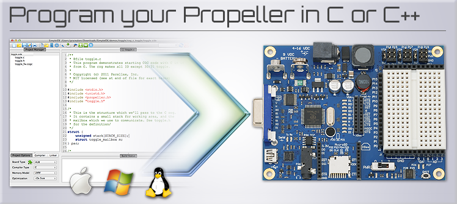

Welcome to an overview of Parallax's Propeller GCC compiler for the P8X32A Propeller chip.  The Propeller GCC Compiler tool-chain is an open-source, multi-OS, and multi-lingual compiler that targets the Parallax Propeller's unique multicore architecture.  Parallax has collaborated with industry experts to develop all aspects of the toolchain, including the creation of a new development environment that simplifies writing code, compilation, and downloading to a Propeller board.  The C and C++ compiler tools provide a significant benefit to Parallax customers who use our Propeller multicore processor.  Using the Large Memory Model (LMM) and Extended Memory Model (XMM) gives the developer the ability to write C or C++ programs that run faster than Spin or exceed Spin's 32 KB program size limit, respectively.  Additionally, Parallax will be publishing tutorials on learn.parallax.com to provide experience to new developers interested in learning how to develop embedded applications in C or C++.  All of this effort will immediately roll into developing compilation tools for Parallax Semiconductor's long awaited Propeller 2 when it is released.

